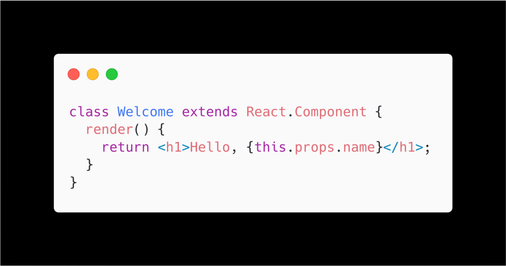
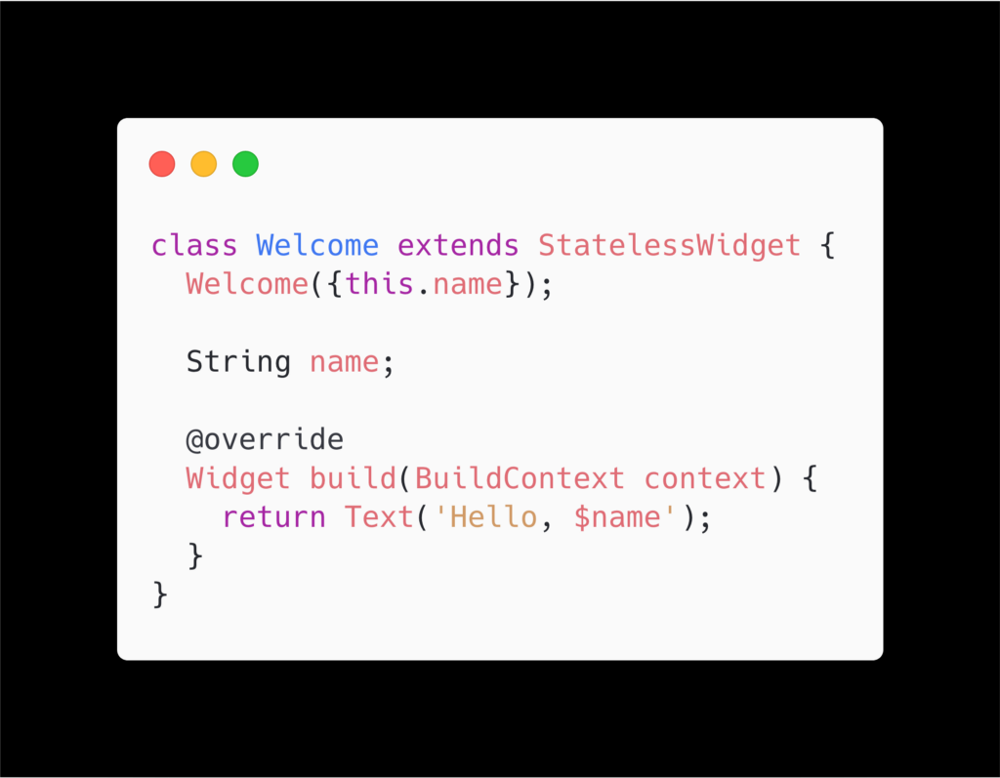
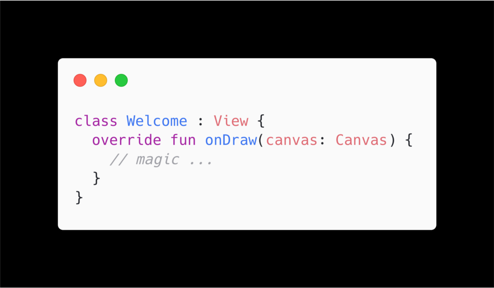
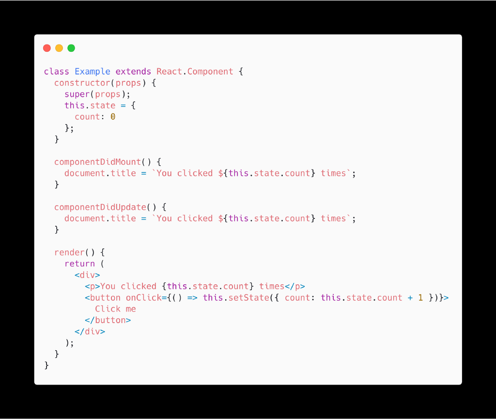
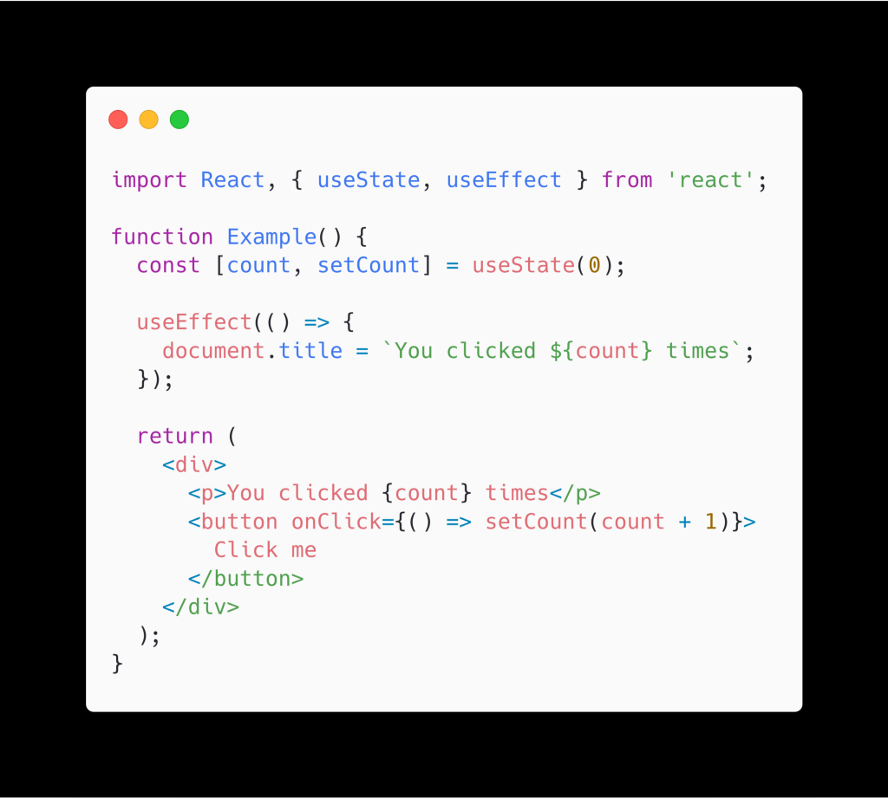

<figcaption>Photo by <a href="https://unsplash.com/@jamie452?utm_source=medium&amp;utm_medium=referral">Jamie Street</a> on <a href="https://unsplash.com?utm_source=medium&amp;utm_medium=referral">Unsplash</a></figcaption>

After months of procrastinating, I am finally getting to the last chapter of “Mental Models of Jetpack Compose”, at least for now. Today, we are gonna talk about components, and hindsight.

### Component

If you just look at the basics structure of Component in React or Widget in Flutter, you will probably find it not too far off from android.view.View on the typical Android View API.

React:

Flutter:

Typical Android View:

More specifically, they all have 1 method that ultimately determines what should be display. So what makes the concept of Component different? Well, the biggest distinction is that the render/build function defines an **abstraction** on what the view should look like, while in onDraw function you are responsible for specifying every last detail. Basically it goes back to [episode 1](https://dev.to/louis993546/mental-models-of-jetpack-compose-1-state-programming-models-20eh), which we talk about declarative programming vs imperative programming.

And that’s pretty much what the concept of component is! On it’s own component is nothing special, what makes it fun and powerful is that it only carries information, not instructions, which usually makes it more understandable, and also more lightweight. Speaking of fun, that brings us to a minor addition to the concept of component. But first, let’s take a look at this example from React:

> _Sample from_ [_React documentation_](https://reactjs.org/docs/hooks-overview.html)

Even if you don’t know JSX, when you read render(), you probably still understand what it is trying to do: it will have a text, and a button, probably as a column, and each click will trigger some text to change. But why are there so many other stuff? OMG does the constructor in JavaScript looks like the one in Java!? And what the hell are componentDidMount() and componentDidUpdate() doing there when they do exactly the same thing?

And if we take a step back, and try to remember why React was created in the beginning, what they wanted to do is basically this:

### UI = f(state)

(read: given a state, a function transforms it into a UI)

So what if we just take that **literally**? That brings us to the concept of **functional component**. The mental model of component is still there, but instead of representing it with a “class”, just directly represent it with the function, and it would look like this:

> Sample from [React documentation](https://reactjs.org/docs/hooks-overview.html)

Making function directly the star of the component encourages/forces us to embrace composition (since there is nothing to inherit from), and all it needs are a set of good API to expose the lifecycle and state management API back out.

React calls this “hooks”, named after all the API (i.e. hooks) it exposes for components to interact with the runtime, i.e. all the use\_\_\_ functions. And after barely more than a year, it seems that React hooks have become the standard way of building components for them. And for Jetpack Compose, which is heavily inspired by React, it took it to the next level/extreme, by only having function components.

### Hindsight

This is the last mental model I want to mention for this series, which is not actually a technical thing, but more of a mindset you should be aware of.

Often when we look at “legacy code”, we will say “ah they should have done X instead of Y”. But then 5 minutes later, you remember you are the one who wrote those code to begin with. Is that because you/that person was “young and dumb” back then? That’s possible, but the far more likely scenario is that things and people change in ways that were not participated. Who knew build time would be such a big issue 5 years ago? Who knew RxJava will be overuse 5 years ago? Who knew assuming there are only 2 genders is a bad idea 10 years ago? Probably not a lot of people.

And that’s what makes hindsight important: being able to learn from not just your own experiences, but also from others, is very important for your learning. And in the context of building a UI framework, knowing how annoying opinionated people can get, and what pattern people often use, are extremely useful information, even if we are not building for the same platform, or with the same language. (P.S. [hindsight from React on what motivates them to create hooks](https://reactjs.org/docs/hooks-intro.html#motivation))

So how does it apply to you? Well, even though there are not a lot of Jetpack Compose material (also half of those blog posts and videos out of date, since the API change so drastically), you can still learn from React, Flutter, and more other frameworks, see what other people have been doing, how they get used to it, what they have learned, and more. I promise a lot of the concepts are applicable to Jetpack Compose as well.

### Conclusion

This will be the end of the “Mental Model of Jetpack Compose” series, at least for now, mostly because now Android Studio 4.0 is available, you can actually go try it out yourself. And very soon I will try to pick some random ideas I have and document my experience of “turning theories into practices”.

And also it’s 0:24 and I really should go to sleep right now 😴