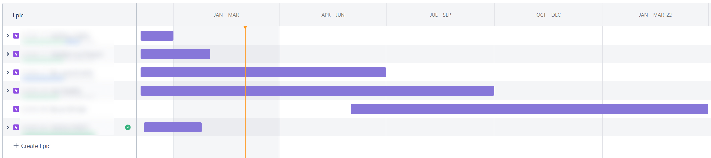
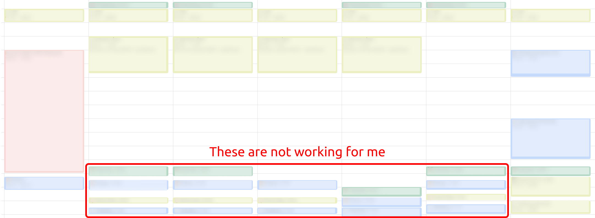
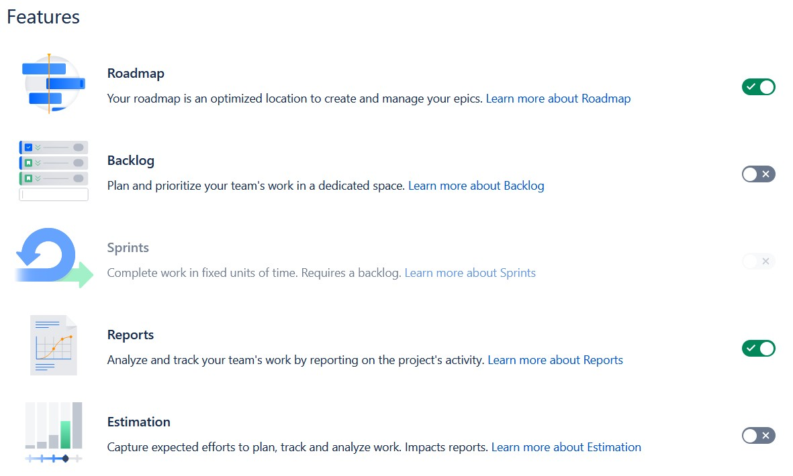

Back in early December 2020, I wrote an article on how I was testing out Jira & Confluence as my management tool. And it's about time for me to write down what I have learned.

## What was the plan?

For all the reasons and context of why I do this, you can read it from [the last article](https://louis993546.com/productivity/). The gist is that:

- Use Jira to manage the tasks I have
- Use Confluence to document the thing I want to remember in the long run
- Use Google Calendar to manage time by filling it up with rough time blocks

## So what works?

### Writing on Confluence is great 👍

One of the key problem that I was trying to solve is to avoid having more and more unstructured documentation, and so far I am very impressed with what Confluence. I can actually use it to get into a flow, and start writing down things, and most importantly, this actually helps/forces me to clear my brain, and see all the random thoughts I have as a bigger picture.

And that's what I am want from any documentation tool. It has the right set of tools, plus a good enough user experience to help me solve real world problems. It's definitely not the fastest/smoothest/prettiest website, and it does have a fair share of quirks. But overall it's pros definitely beats it's cons 👍

### Epics forces me to pick and choose 🎯

One of the takeaways I have from this experience is that I always "tries" to do too many things at one. Learn 3 different programming language all at once? Sure why not!? Should I spend time to learn how to cook better, how to write better, or how to get fit? Why not all!?

And when I starts to write my tasks down in Jira, the little "Add an epic" hint text nudges me to categorize all the tasks I am doing, and with the help of the timeline view, it actually helps me better understand that "No, you probably shouldn't do all of that at the same time". Like it's fine to be "Jack of all trades, master of none", but you know, you at least have to be a "Jack", i.e. "good enough" for each of those things. And having the timeline view visualize all of it, and pushes me to say "no", or at the very least "not now".

### Google Calendar mostly works 📅

So far the best part of this experiment is definitely the use time blocks on Google Calendar. It's not the best because it works perfectly. It's the best because I learn the most from it. Here's what happens

**In month 1 (i.e. December)**: Since I took vacation for almost the entire month, I can very easily fit tasks onto it, and follow what I have planned. No problem so far.

**In month 2 (i.e. January)**: Now that I am back to work, now I have to figure out how to balance between work, the German course that I'm taking, and all the other tasks that I want to do. And pretty much for the entire month, I failed to actually stick to the schedule. Either by not having the energy/mood to finish my tasks after work, working extra hours, or combination of both.

**In month 3 (i.e. February)**: After all the setback and further experiments, by mid-February, I have made enough changes to mostly stick to the schedule again.

<figcaption>Scheduling tasks like this does not work for me at all</figcaption>

So what happened? Back in month 1, since I have pretty much the entire day to play with, I often make each time block bigger than it has to be, so that even if I start doing random things (e.g. replying to messages in the 1 hour reading block), there is probably still enough time to get back to flow.

And when month 2 and work starts, What I did was just to squeeze all of those into smaller blocks, but still with the same frequencies. That means I always have like 10 events on the calendar, each one is 30 minutes or less, and that means way too much jumping between tasks, and it just got extremely tiring and frustrating really quick.

So I started to make changes, moving things around, delete a task or two, but turns out it's not enough. I ended up deleting all the future time blocks, and start fresh to figure out what I actually want to do, and where do they fit on the schedule. I know I have German course in the morning, and work in the afternoon. I know I will have lunch in between, and dinner after work. And just keep doing that, and slowly figure out how much "free" time I actually have for each day, and start scheduling bigger blocks. And there are a few more adjustments before I got back to the point of "mostly sticking to schedule".

One thing I want to clarify is that this is what works for **me**. Maybe your brain likes having different tasks to keep it fresh. The key takeaway is that **by forcing myself to plan what I want to do, it forces me to understand what I actually want to do**, and adjust my plan accordingly.

## And what doesn't work?

### Jira is not for managing small tasks 😡

It all broke down the first time I try to use Jira to manage my grocery list. It is just not design for simple "check-and-forget" type of task management. And to be fair that's not they are trying to be anyway, so that is perfectly fine. All I have to do it to replace it with something much simpler, and for now I am using the build-in Reminder app on my iPhone. It is good enough to keep track of grocery list, as the integration with Siri is kinda useful.

### Next-gen project is master of none

So in the original article, I cite the existence of the next-gen project as one of the main reason I want to give it a shot. And after 3 months, I have come to the conclusion that it is not good (yet). In Cantonese there is a idiom "兩頭唔到岸", which literally translates to "both sides not touching the shore", figuratively translates to "you try 2 different options but neither of them work (probably because you try both at the same time)". And to me that feels like the state the next-gen project is in right not.

On one hand, it sit somewhere in the middle of configurability; on the other hand, it is not flexible enough to get it to work exactly the way I want it, while on the other hand, it also try give people some choices by putting way too many feature toggles. I understand that why Jira is taking this approach to build the future of their product, but at this point in time, it's not that fun to actually use it.

### It's not mobile-friendly

First what I want to clarify is that the app itself is pretty damn good. The iOS app is snappy, and it's UI strike a good balance between Atlassin and Apple. However, because of the structure of how Jira works, it's just gonna be hard to make it easy to use on small screen devices. From having to pan in both directions to see all your tasks on the board, to having no shortcut to move a ticket from one lane to the other one.

## So are you going to stick with it?

The results are in, and they are:

| Tool            | Grade | Action                  |
| --------------- | ----- | ----------------------- |
| Jira            | ❌    | Moving away from it     |
| Confluence      | 🤔    | Looking for replacement |
| Google Calendar | ✅    | Keep using it           |

#### ❌ Jira

When I look back, it's very obvious that Jira is not actually helping me to actually get things done. However, it is very good at making me feel productive when I am playing with it, which IMO is exactly the worst part of Jira. Even with next-gen project, Jira is still a very complex product, and that's why we ended up spending so much time and effort just to use it. For me, task management is just a means to an end. I don't need to feel productive using Jira, I need to feel productive working on things I listed on Jira.

And for the time being, I have move all the tasks to another task manager. Once I got more ideas of what exactly I am looking for, I might write another follow-up for that 🤷‍♀️

#### 🤔 Confluence

On one hand, the experience of using Confluence is good enough that I am actually using it to clear my head. On the other hand, without Jira, it loses the biggest reason why I picked it in the first place: easy of connection with Jira.

For the time being, I am keeping most of the documents there. Some types of document with specific purposes (e.g. journal/blog post) is being moved to other places. I can slowly start looking for some documentation workflow that fits what I have, hopefully I will find something by the time everything falls apart 🤞

#### ✅ Google Calendar

Given it's one of the high-light of this experiment, of course I am going to keep it. As I mentioned above, this is a lot less about the tools itself, but more about having a workflow that works for me. So I will just keep an eye to make sure I adhere to my time block schedule 👍

---

## So what's the plan?

Apart from those 3, there are also other things that I am trying out to improve my productivity.

- Keep track of how much time I spent (wasted) using Toggl Track
- Note taking and reading with reMarkable 2
- How to use Pomodoro in moderation to keep free-flow focus time running smoothly
- How does the physical environment (i.e. my apartment) affects my motivation
- How does the equipment (e.g. my computer) affects my focus and efficiency

If any of them start getting interesting, I will just write another post. But at this point it's still too early to tell 🧐
