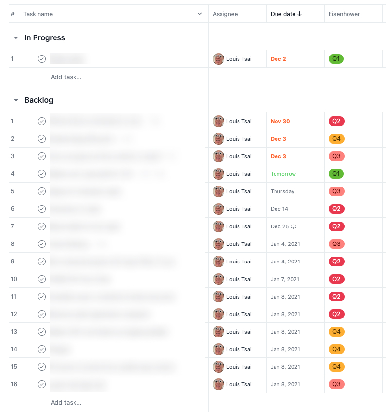
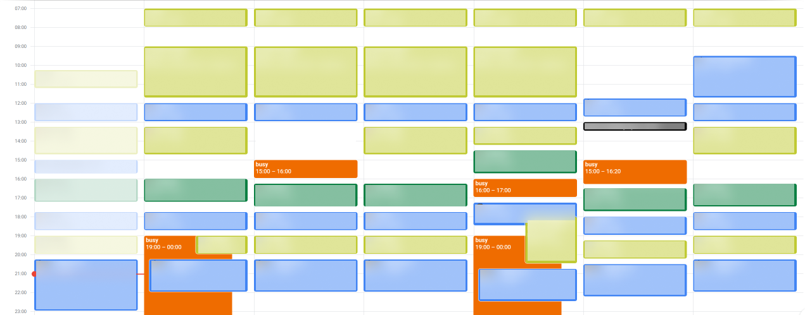

# My plan to become more productive in a month

2020 is almost over, and I just so happen to have almost an entire month off to do whatever I want. One of the things I have learn about myself this year is that my productivity often relies on supervision & "too afraid to say no so now I have to get it done in the next 4 hours". So one of my goal in the next ~~month~~ 25 days is to figure out something that can keep me productive (and hopefully subsequently fulfilled and happy).

## What's the status quo

Currently, I have 2(-ish) system going on: 1 for my work stuff, and 1 for my personal stuff

### Work: 2D version of Einsenhower Matrix using Asana

For some reason, I remember very distinctly how I got introduce to the Eisenhower Matrix: it was when I was like 16, during a tutorial session (Hong Kong style, i.e. watching a pre-recorded video from one of the "famous" tutors), in which there was just me and 1 other student. Anyway, ever since then, I have this concept in mind for a lot of the things I do, but for like 10 years, I have not been able to translate to something that works. I either worry too much about things that I should not be (e.g. "What if I need to work remotely", which never happen until COVID-19), or I just don't really need/care about a comprehensive system. That chances a few months ago:

Back in August, I got a chance to become a temporary team lead, which means my role changes from "dealing with Jira tickets" to "making sure others have Jira tickets to deal with", which means a shit ton of meetings, a shit ton of messages and emails, and a shit ton of documents to write. It doesn't take long before I realize how fucked I am if I don't come up with some system that works, and that combine with moving to a bigger place for myself, I ended up dedicating a wall to build a physical Einsenhower Matrix

And it actually works pretty well! It forces me to be honest to myself what is urgent/important, and stop working on things that's interesting but can be dealt with later. And that's what I have been using for about 2.5 months. And then November comes, and I started to take some lessons before going to work in the office, which means now I need some ways to make it portable. And right now in our team, there seems to be a trend to use more of Asana to organize tasks, and since the company is already paying for it, I might as well give it a shot. 

It does not take long before I start missing the Eisenhower Matrix. While "urgent or not" can easily be reproduce by due date, there does not seems to be a build-in way to indicate importance. Thankfully after a quick Google, I found an extension call [Asana2Go](https://chrome.google.com/webstore/detail/asana2go/meaajmlecpkbjcofehfpjngpnpfpjlkd), which has a feature to build an Eisenhower Matrix by adding a custom field to specify which quadrant does a task falls into. Actually, after like 2 days, I just use the custom field and forgot about the extension completely. I just rely on sorting to display the tasks by due date first, then pick the next task to work on according to its quadrant. 

And it has been about 2 weeks since I started using this Asana + custom field to mimic Eisenhower Matrix, and so far I really like this approach. As long as I can figure out a way to Asana visible (i.e. a vertical monitor), I am able make sure I work on the next most urgent and/or important task 👍

(And of course we use Jira for all the tickets 😭)

### Personal: "Whatever is closest to me" is a system, right?

For my personal tasks, I have not been paying much attentions to it for a very long time. I switch between different to-do-list-app constantly, and even more ways to keep track of my notes. Here are some of the things I have tried

- Evernote + Google Tasks
- OneNote + Google Tasks
- Google Drive + Wunderlist (RIP)
- Google Drive + Todoist
- GitHub + (every to-do-list-app)
- Calendar + Google Tasks (the new one)
- Google Keep + Apple Reminder
- Apple Notes + Apple Reminder
- Microsoft To Do + reMarkable + Post-it notes on the wall + Apple Notes + Google Keep

As you can see, it's really a mess.

## What's working

### Separating work & person tasks is mostly good

Except for 1 or 2 edge cases, I have extremely separate personal and work life (that's just how I always deal with things). And so far the only "issue" I really have is that there is no way to check work tasks if I don't have work machines with me. For 95% of the time, that's not a bad thing anyway.

### Due date + Eisenhower sorting is actually not bad

Like I said above, so far I am really enjoying the 2D version of Eisenhower matrix using Asana. It forces me to give each task an end date, it's easy enough to figure out how those tasks are gonna fit into the schedule, and it's super easy and satisfying to update and finish a task 👍

## What's not working?

The entirety of my personal system is not working. It's not just the fact that I didn't get things done on time, the fact that I constant switch systems also translates to a lot of long term tasks and goals getting lost. While so far it has not cause any major trouble, it definitely needs to be fix up ASAP, hence this article.

## What are the options

### Notion

It sponsored so many YouTube channels to a point that it's kinda hard to escape it. I have created an account to play with it a little bit to see what it's all about, and while it definitely looks nice, I am not sure Notion is the right approach.

(Note: this is **not** a review of Notion at all)

- It feels too flexible
- It often feels like a bad compromise between "a full fledge tasks management system" and "a full fledge note taking system"
- It's not satisfying to use, esp. from my phone

### Google Calendar everything, LITERALLY

I think I very briefly tried it in the past, but life is just way too chaotic to try to schedule every little tasks. It took me maybe 2 days before I realize how stupid I was.

### Other apps/system/method that I have heard of/tried before

- [Hour Blocks](https://apps.apple.com/gb/app/hour-blocks-day-planner/id1456275153): not a bad idea, but the fact that it relies on my phone (i.e. source of distraction) means I can't use it. However, I do like the idea a lot 😍, which you will see in a minute.
- Pomodoro: In a world where I have a bunch of meetings, Pomodoro just doesn't fit well into the system. I need something that's more flexible & more predictable at the same time, and "let just start a 25 minutes timer at any time of the day" it just not gonna work on itself.
- Asana: I don't wanna pay for my personal account🤑. Also I don't think all the project/milestone/roadmap are useful to organize my personal tasks anyway.

### Build my own app

Because I don't have enough dead side projects already 😂

------

And the winner is......

### Jira!? 🤨

I know this does sound like the stupidest idea. Isn't it already tragic enough that I have to use Jira on a daily basis at work, why am I doing this to my personal life as well? Well, let me explain a bit of what I have learned in the last 3 months of dealing with Jira......

#### Pros 1: Configurable

On one hand of the spectrum, you have tools like Microsoft To Do, in which there is pretty much nothing you can configure. And then you get tools like Asana, which (if you pay) you have access to custom fields, some decent filtering, but you are still very much in the bubble of how Asana thinks you should work. And then there is Jira, in which most things are configurable, but it still feels very "type-safe" and somewhat complicated to change, but at least it's possible. And if you keep driving along the spectrum, you will get to tools like Notion and AirTable, which basically is a free canvas/spreadsheet/database/all-of-the-above with extra steps. 

#### Pros 2: JQL

As a programmer, the fact that there is a query language to find tasks has proven to be a godsend. Imagine if you got dozens of new tickets a day (that's not kidding, it seriously happen for like 2 months straight), there is no reasonable way to keep them sorted and filter correctly without something advance, and JQL has proven itself to be very useful. I hope it won't come to that day for my personal tasks, but you'll never know.

#### Pros 3: Next-gen project

Another thing that makes my personal Jira better than the work Jira is the fact that I am using the next-gen project. It is actually a lot closer to Trello (which is now another Atlassian product anyway) than the traditional Jira. And since it's just me and myself in the "project", something lighter and simpler is just what I need

#### Pros 4: Reasonable app

There are so many software that never figured out how make their mental model works well in mobile client, and for that I really have to applaud the Jira apps. It's actually pretty useable. A lot of other apps either can't figure out how to make all the info fit on screen (e.g. Asana, in which the list does not display any fields), not a very good app (e.g. Microsoft To Do, in which I very often swipe away a task when I was just trying to go back), or combination of both (e.g. Notion, which is just trying to cramp the entire webpage to a small screen. Please stop). 

#### Pros 5: Confluence (🤞)

If you take another look in my person system above, you can see that I often have a tasks list + a note taking app. And so far, they are always 2 separate entities, and some information are always separated. And right now I am hoping the fact that Jira & confluence can cross-reference each other can turn itself into something a lot more powerful. I have seen how it makes my life a lot easier when I build our team's documentation at work, and I am hoping to transfer that to my own Jira + Confluence setup.

#### Pros 6: I am already using it at work anyway

I have spend the last 3 months managing tickets on Jira, and documents on Confluence, I am already quite familiar with how it works, even though we are still using the ~~ugly~~ classic version of Atlassian apps. And at the end of the day, I am trying to get shit done, and spending way too much time to figure out how to setup a new system is not particular practical.

### Actually, it's Jira + Google Calendar

So Jira should explain all the part about task management & documentation. And for time management, I think we are all stuck with Google Calendar anyway (if you have any reasonable alternative please let me know 🙏). However, I took the idea of Hour Blocks, and only put big generic blocks of tasks, instead of trying to make detail and accurate schedule. 

For example: currently I am reading the "Atomic Habits" by James Clear, and I am trying to have a committed time and place to actually build my habits. So about 80% of the blocks you see are actually events to build my habit. And the fact that I can easily make sure they are not interfering with my other events and meetings is extremely useful. 

So far the only major thing that's missing for me is the lack of a easy (and free) way to see both Jira and Google Calendar together, and so far it has not been a big issue.

## Conclusion

So this is what I am trying out for the next 25 days. Let's see if this system is enough to drive me back to a productive and healthy lifestyle. And if you don't see a follow-up of this article in January 2021, there are only 3 possibilities

- Shit hits the fan and I got busy AF
- The system does not work
- I am dead

🤞🤞🤞🤞🤞
