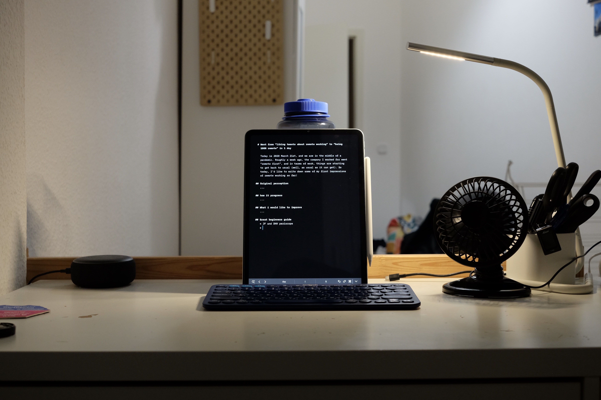
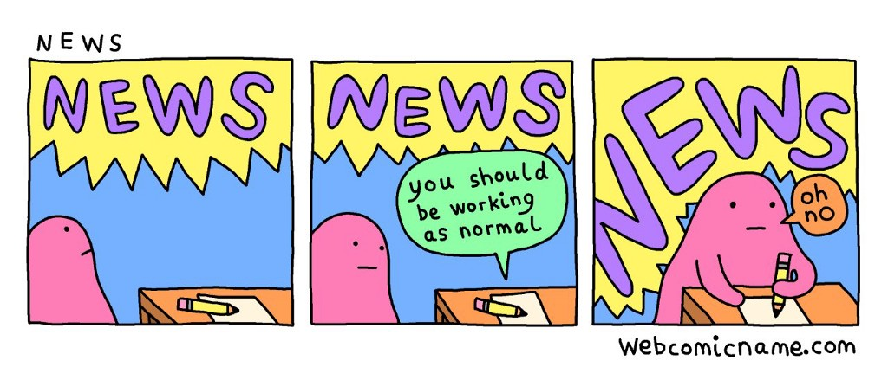

_My desk setup from a week ago_

Today is **2020 April 1st** , and we are in the middle of a pandemic. Roughly 2
weeks ago, the company I worked for went “remote first”, and in terms of work,
things are starting to get back to usual (well, as usual as it can get). So
today, I’d like to write down some of my first impressions of the whole
situation so far!

### How it went down (simplified)

Even before Berlin starts getting it’s first COVID-19 case, there has been a
bunch of people asking if the company’s policy about WFH and other preventive
measures are gonna adapt to it. And after Berlin has it’s first confirmed case,
it takes a few more days until the management establishes official news source.
And a few more days (& a lot of messages on the chat room) later, the company
held a basically impromptu-all-hands in the morning, and announced the procedure
of how to “apply” for WFH for most employees. And the next thing you know, half
the people are gone before lunch.

### Perception of remote working before this

I have been living in Berlin for 3 years now, and worked in multiple companies
as full time employee, in their office, at least 9–5. I am now mostly used to
it, but I don’t think I ever really liked it.

I like being able to easily make friends at work, but I don’t like waking up
when it’s one of those days where I just don’t feel like socializing at all.

I like that it forces me to have a consistent schedule and lifestyle, but I
don’t really enjoy the hours being so inflexible, given my work is not really
time-specific.

I like that an office provides a safe space in terms of productivity (usually),
but I hate having to spend 1+ hour each day on the commute.

> TL;DR: I never **hate** showing up to office per se, but I have a list of
> things I can complain about.

### The first 24 hours of “OK you work from home now”

Even though I was one of the people who tried to push the company to adopt WFH
as soon as possible (i.e. “wrote on the super long COVID-19 thread to keep the
conversation going”), the sudden announcement still throws me off. I spend
basically the whole afternoon planning what do I have to do to get my room
ready, and try to organize the work to make sure I won’t forget anything
(although this didn’t really work because I was so distracted the entire time).

I left office a bit later than usual to try to avoid the crowd, and then I went
to supermarket to get enough groceries for a week, and tried to go get a
microphone for all the video chat (although the store was out of the cheap one).
The last thing I did before officially working remotely is that on the next day
at 7AM, I planned out how I am gonna move the furnitures in my room around to
have a more separate work & rest place (sorry downstairs neighbors). Living in
a tiny room in a share flat in the middle of a pandemic is not ideal.

> TL;DR: Chaotic

### What happens in the next week

In terms of the work itself, things are quite typical, since it is such a short
notice, we are not really prepared to adapt anything to be more remote friendly.
We still have a lot of meetings, but with video chat instead of face-to-face.
It’s ever so slightly worse than what I usually experience.

In terms of productivity, I’d say I am able to focus around 60% of the time.
There is only so much you can do to improve your home office in such short
notice. And I tried to compensate for it with working extra hours, which ever
so slightly cancel out my reduced productivity (but not sustainable at all).

<figcaption>Thiscomic from Alex Norris speaks to my soul: <a href="https://twitter.com/nadiaoxford/status/1239588500212789248">https://twitter.com/nadiaoxford/status/1239588500212789248</a></figcaption>

The biggest change probably happens in terms of my sanity. This sheer amount of
news around the pandemic drives my stress level high already, combine with
issues with the work itself with a tight deadline that actually needs to be met
or “shit might go down”, and me trying to compensate it with extra work hour, is
driving my mood to an all time low.

> TL;DR: Externally business as usual, internally pulling my hairs out

### Now what?

Knowing that I will be stuck on this chair for a while, I am starting to plan
how am I gonna survive this without going me insane (if I am not already
insane).

First thing I did: online shopping. If all the advertisements have taught me
anything, it is “buy this product and your problem will go away”. I am now aware
of how much “useless” things I just bought, and I am doing a slightly better job
at controlling my spending habit than a week ago. But I do need to make a few
adjustments to the physical environments, and I am fortunate enough to have some
saving & incomes to do just that.

Next thing I did: spend a lot of time on the internet to try to figure out how
WFH usually work. What should I expect (under normal circumstances), how should
I adjust that expectation based on the situation, how people usually work, etc.
One of the thing that kinda blows my mind is the [Q&A session by David
Heinemeier Hansson and Jason Fried from
Basecamp](https://www.pscp.tv/w/1nAKEdbbnPgxL). While some of it do feel a bit
too much like an ad for Basecamp, I think the rest is a good short summary of
what a team of expert remote workers is experiencing, along with how newly
remote workers can/should expect.

While I am coming up with a list of improvements for my surrounds physically, I
also started to think about how to change my behavior to reduce my stress level,
so that I don’t have to pull my hairs out.

#### Workout

A lot of people have suggested that keeping your workout routine is very
helpful, and I will try to do some quick research on what body weight exercise
can I do in such a tiny space. I haven’t do much body weight exercise since my
Uni days.

#### “Separation of concerns”

A lot of people also suggested to keep your work space and personal space
separate. While it’s physically hard to do in my tiny room, I can kinda achieve
that by removing all work-related items from my sight (all notes, computer,
accessories, etc.) when the day is over, and let my laziness do the the rest
(a.k.a. “Nah I am too lazy to move the chair and take the computer back out. I
will check it tomorrow”)

#### Clean your room/apartment/mansion/whatever

A lot of people suggested to keep your space tidy, plus the act of tidying can
double as a distraction. That’s just a good idea in general, especially now that
we are all spending 24 hours in the apartment everyday.

#### Spend less time on internet

First I have to say I love the internet, without it I would be absolutely
useless. But in the last few months, the amount of time I spent reading COVID-19
related news is pretty much inversely proportional to my mood.

Back in 2003 when SARS was hitting Hong Kong, I remember everyone can’t stop
watching the news, and it drives everyone into panic mode. And this time around,
it started for me back in Jan-Feb, when my family and friends in Hong Kong are
panicking on how they are gonna get enough masks, and pretty much my entire
instagram feed is about how people are trying to keep themselves safe (from the
virus or the police, or both). And when cases start to appear in Europe, I just
can’t stop scrolling on Twitter and panic.

And even if you find the news about COVID-19 useful, there is still a huge
problem of misinformation being share around, from random obfuscated screenshots
on Instagram, to actual leaders of multiple countries (yes of course I am
referring to Trump). One of the most vivid memory I have is that in the early
days of the spread in Hong Kong, no one actually knows what the symptom should
be, how they spread (WHO were saying “human to human transmission is unlikely”),
and someone share a (later to be proven fake/taken out of context) video, of a
men puking blood on some China subway/underground/U-Bahn/MTR, for like a full
minute straight. That was really disturbing, not because of the visual, but the
idea of “what if this happens to people I care about”. I was (and still am) not
prepared for this. I just can’t stop thinking about it and focus at work for 2
days straight.

I think it’s safe to say I should spend a lot less time on the internet.

#### Take up some new hobbies/pick up some old hobbies

Now that I promise to spend less time on the internet, I’d need some other form
of distractions. Some of my recent hobby-building purchase (i.e. online shopping
spree) includes buying a Nikon FM (i.e. an old-school film camera from the 70s?),
some books (currently reading 
[how to by _Randall Monroe_](https://www.goodreads.com/book/show/42086897-how-to)), 
and a decent speaker set (Creative T40 II to be exact. I am not an audiophile I 
just bought it because my work computer speaker starts cracking). Each of them 
should be enough distraction for quite a while.

There are also hobbies that does not involve extra spending, like writing, 
playing some instruments (A lot of people probably have an instrument laying 
around), or cooking (you have to eat everyday anyway, might as well make your 
food better).

We are all gonna be stuck here for a while, and by we I mean those who are 
privileged enough to work from home. The best we can do is to buy scientist 
and manufactures time to develop the vaccine and more effective cure, to help 
keep those who cannot work from home as safe as possible. In the day and age 
when both the physical world and digital world is plague with danger, it would 
be my first step to figure out how I can embrace remote working and get my 
sanity back on track.

Stay safe!
