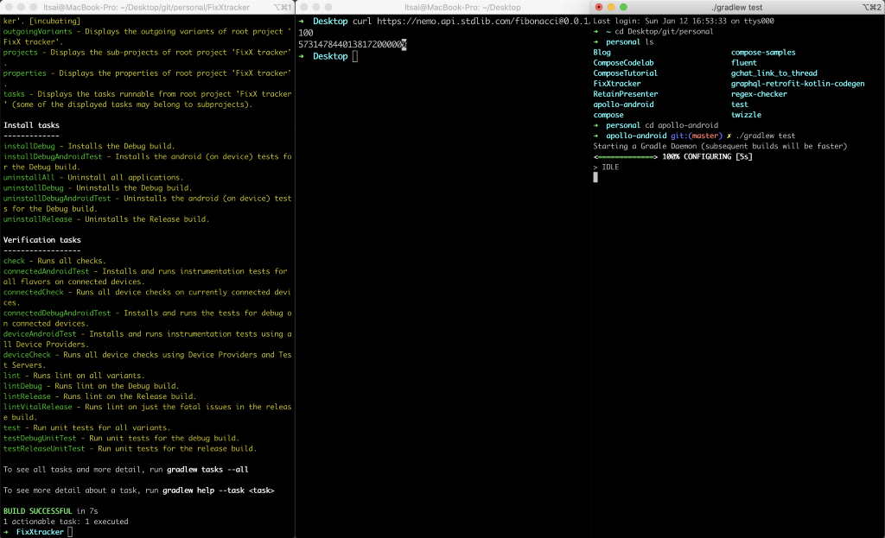

<figcaption>A bunch of random stuff you can do with shell script</figcaption>

It has been a while since I did my last “From Android zero to kinda-middle” series, and today I’d like to talk about shell script.

### WTF is shell script

You can think of it as a scripting language + the program that interprets it.

### Why you should know shell script?

All the buttons in Android Studio will ended up executing some shell script in one way or another. For example,

“Run” 👉 ./gradlew assemble\${flavor} + adb install

Install newer version of Android SDK 👉 sdkmanager "platforms;android\${versionCode}"

Commit 👉 git commit -m "\${message}"

But if all of the task can be done with buttons, why would anyone want to type all the steps out instead? Well, if you have a series of events you want to run repetitively, having a script will often makes it a lot easier to deal with, esp. when comparing to reading documentation and do it step-by-step. And those automated task can also be done by computers more accurately, for example, have a computer that builds and ship the app every time master branch is updated. And that is basically what "Continuous Integration" or "Continuous Delivery" (also known as CI/CD) are.

But this only explains half of the question. What makes shell script different than, let say JavaScript? Well, it’s all about the history. Shell script is very much tied to Unix, i.e. the foundation of Linux and macOS, and the popularity of the 2 (among developers and servers) makes it pretty much the universal way to tell a computer how to do something. Not only that, being super close to the operating system, it allows a multitude of tools to do whatever they want to do, from transforming video between formats, frame rate, resolutions, and more with ffmpeg, to compiling Java/Kotlin code with javac/kotlinc, to tools that communicate with external sources or devices like curl or adb.

### What can shell script do

In general

- Travel in the file system (cd) 🚙
- See where you are (pwd) 🗺
- Create folder(s) (mkdir) 📁
- See what files are there (ls) 🗂
- Modify files (vi/nano) 📝
- Open files and programmes (open on macOS) 👀
- Read files (cat/less) 🖨
- Install other softwares (brew) ⬇️
- Version control with Git (git, dah) 📚
- etc.

Android-specific

- Talk to Android devices (adb and fastboot) 📱
- Update tools to build Android app (sdkmanager) 📲
- Contribute to AOSP (repo) 💪
- Use dependencies (gradle) 😯
- Build the app (still gradle) 😮
- Test the app (also gradle) 😲
- Install a specific version of gradle (yes the answer is gradle, and then you can use gradlew) 🤯
- etc.

### How to run shell script

> If you are on Windows, I’m sorry but 50% of this article is not for you. While the concept is the same, they are so fundamentally different, that you should be using something call “Command Line” or “PowerShell”. These are 2 different program + scripting language that runs on Windows, and I have little to no knowledge about them. A quick Google will help you a lot more. And if you are brave enough, you can also try out WSL (and WSL2) to run the following steps. Not everything will work.

Now that Windows users are out of the way, let see some basic commands on Linux or macOS!

1. Open “Terminal” on your computer
2. Use pwd to see where you are in the file system
3. Use cd \${folder name} to move into a folder
4. Use cd .. to move to out of a folder
5. If you are not sure where you are, just type cd will take you back home.
6. Use mkdir \${folder name} to create a new folder
7. Use touch \${file name} to create a new file
8. (macOS only) Open a file with it’s default program with open \${file name}
9. (macOS only) Open a folder with open .
10. . means the folder you are currently in
11. man \${command}(e.g. man git) shows a manuel of the command

And now, let’s try to create a new git repository, and then delete it

```
# Create a folder
mkdir newProject
​
# Move into that folder
cd newProject
​
# Tell git this is a new repository
git init
​
# Create an empty README
touch README.md
​
# Enter some text into README
echo "# Hello, World!" > README.md
​
# Tell git to stage everything
git add .
​
# Commit with message
git commit -m "Initial commit"
​
# Show commit history
git log
​
## Go back out
cd ..
​
## Delete folder (the -r is needed to remove folder. It stands for recursive)
rm -r newProject
```

All the line starts with # are short comments that explains what the command does. And feel free to mix and match all of these, or just randomly roll around and try things out. But be careful, you don't want to mess up your computer.

### Practical shell script examples

#### Install [httpie](https://httpie.org/), a pretty user-friendly way to call REST API form terminal

On **Linux** , there are a lot of “Package Manager”, and in this case we will use Debian/Ubuntu as an example, which uses apt-get, and that is includes when you install the OS.

```
sudo apt-get update
# Then type your password for the computer

sudo apt-get install httpie
# Then you will have to accept it

http --version
```

And on **macOS** , the most popular package manager is call “[homebrew](https://brew.sh/)”, and first, you will need to install it. At the time of writing (Jan 2020), you just need to run

```
# This is from Jan 2020. Please check the website for the most up-to-date install instruction
/usr/bin/ruby -e "$(curl -fsSL [https://raw.githubusercontent.com/Homebrew/install/master/install](https://raw.githubusercontent.com/Homebrew/install/master/install))"

# Install httpie. This will usually take quite a while
brew install httpie

http --version
```

#### Run unit tests for the entire project

```
# Assuming you are already in the folder of your project
./gradlew test
```

#### Verify code style with pre-commit hook

[ktlint](https://github.com/pinterest/ktlint) is a tool that verifies and fixes kotlin code. And git hook is basically a script that runs in specific time in the git process, in this case, pre-commit will run when you are trying to commit, and if it failes, the commit also fails, which makes it a great place for enforce coding style in a team.

```
# Install the latest version (0.36.0)
curl -sSLO [https://github.com/pinterest/ktlint/releases/download/0.36.0/ktlint](https://github.com/pinterest/ktlint/releases/download/0.36.0/ktlint) &&
  chmod a+x ktlint &&
  sudo mv ktlint /usr/local/bin/

# Ask ktlint to install itself as pre-commit git hook
ktlint installGitPreCommitHook

# Imagine you have typed some kotlin code that's not perfectly format

# Commit and this will fail
git commit -m "Bad commit"
```

#### Build & Publish app automatically with Gradle and fastlane

You probably already know the existance of Gradle (via build.gradle), and fastlane is a tool that can automate a lot of stuff for Android and iOS developers. Instead of writing all the steps here, please checkout the official documentation on how to [install](https://docs.fastlane.tools/getting-started/android/setup/) and [publish to Play Store](https://docs.fastlane.tools/getting-started/android/release-deployment/), and [this article from GitLab](https://about.gitlab.com/blog/2019/01/28/android-publishing-with-gitlab-and-fastlane/) on how to compile and run fastlane on Linux.

### Closing words

I still remember when I start learning/using shell script from about a year ago, and I was like “Ugh really? It’s 2019 and I am going back to using computer like the 70s?”. But after a while, I realised the flexibility of it opens a lot of doors. It did took a while for me to understand some basic shell script syntax, but I promise you at some point you will file some usecases that shell script will make you life as an Android developer a lot easier to deal with! Thank you for reading, and I will see you next time!
